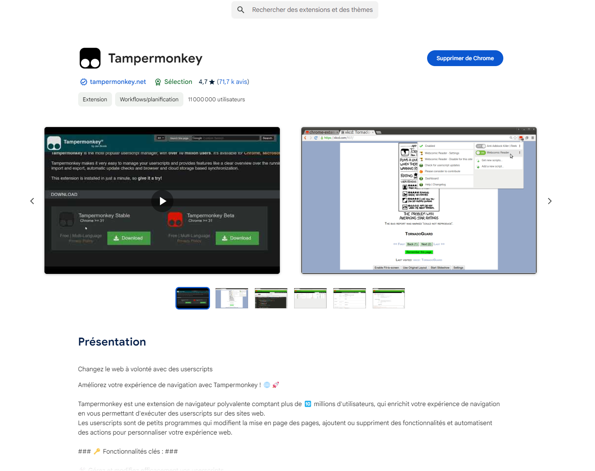
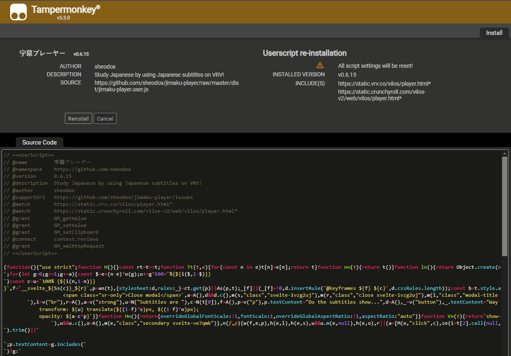
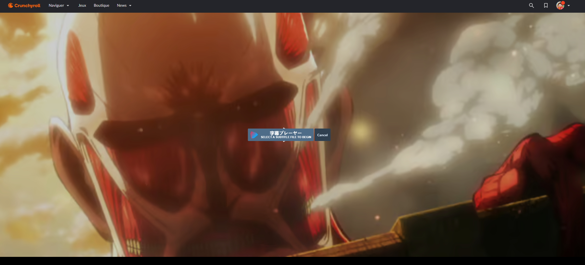
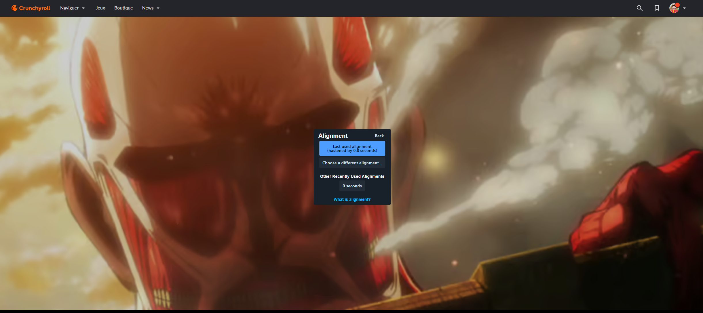
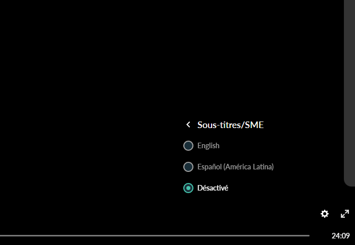
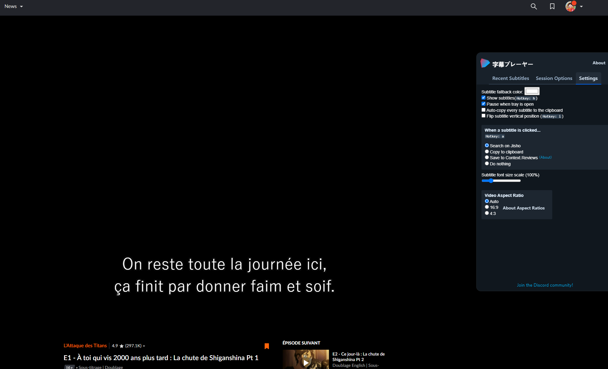
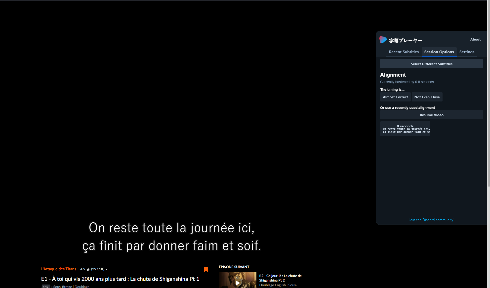

# How to add any Subtitles to Crunchyroll on PC

# Prerequisites 

* **a web browser:** Chrome, Microsoft Edge, Safari, Opera Next or Firefox.
* a Crunchyroll account

# How to

1. Download and install Tampermonmkey web browser extensions
   2. All web browsers: https://www.tampermonkey.net
   3. for Chrome: https://chromewebstore.google.com/detail/crunchyroll-with-better-s/ianobidcnpbeejlkclkfacnipclgiiak
    
3. Install Jimaku Player
   3. Click on this link: https://github.com/sheodox/jimaku-player/raw/master/dist/jimaku-player.user.js
   4. The page is automatically redirected to Tampermonkey extension page.
   5. Click on "Install" button
   
6. Download any Subtitle on https://www.opensubtitles.org/
   7. for example Attack on Titans in French: https://www.opensubtitles.org/fr/ssearch/sublanguageid-fre/idmovie-151586
8. Go on Crunchyroll desired anime episode
9. Select the downloaded subtitle file (Blue Ray may be the best option)

10. Select an alignment if you already now, else just chose 0

9. Disable any Crunchyroll subtitle

10. Place the subtitles on the bottom of the video
    11. use 'í' on the keyboard while the video is running or move your mouse to the right of the screen to display the settings menu
    12. Uncheck "Flip subtitle vertical position"
    
13. If the subtitles are not correctly aligned
    14. use the Session Options tab in the settings
    15. change the timing as desired
    